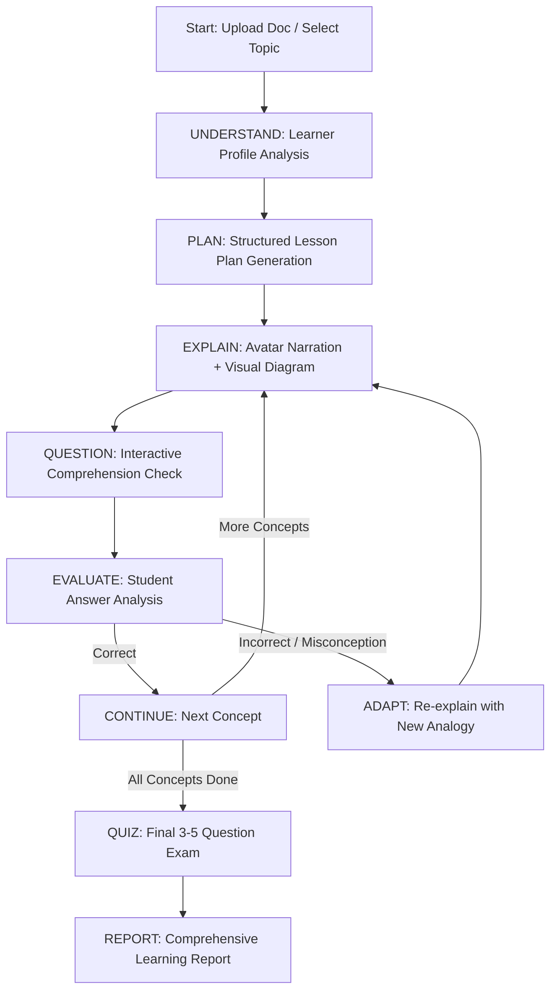

# AI Teacher - Architectural Brief & System Design

## 1. System Overview
The **AI Teacher** application is an intelligent, adaptive educational system designed for the hackathon challenge: *"A human-like AI educator that teaches through AI-generated video"*.

The core architecture combines:
1. **Explicit State Machine Modeling** (LangGraph pattern): Controls the pedagogical flow (`Understand` → `Plan` → `Explain` → `Demonstrate` → `Question` → `Evaluate` → `Adapt` → `Continue` → `Quiz` → `Report`).
2. **RAG & Knowledge Grounding**: Ingests textbook documents (PDF, DOCX, PPTX), extracts structured chunks, stores them in Chroma vector DB, and forces citations into generated explanations.
3. **Decoupled Avatar & TTS Pipeline**: Abstracts audio synthesis (English & Hindi) and avatar video generation into a swappable `AvatarService` interface with support for HeyGen, D-ID, and synthesized fallback media.
4. **Mid-Lesson Language Switching**: Seamlessly toggles lesson delivery language (e.g., English ↔ Hindi) on the fly without resetting state or score progress.

---

## 2. State Machine Design

### State Object Schema (`LessonState`)
- `session_id`: Unique session string
- `topic`: Topic name or document title
- `learner_level`: `Beginner`, `Intermediate`, `Advanced`
- `language`: `en`, `hi`
- `time_budget_minutes`: `10`, `20`, `30`, `60`
- `current_state_node`: Active state node string
- `current_concept_index`: Zero-indexed step pointer
- `concepts`: Sequenced list of concept objects
- `state_logs`: Chronological list of inspectable state transitions with adaptation rationales

---

## 3. Technology Stack

- **Frontend**: Next.js 14 (App Router) + Tailwind CSS + Lucide Icons + Mermaid.js + KaTeX + Canvas Confetti
- **Backend**: Python 3.11 + FastAPI + WebSockets + Uvicorn
- **LLM Orchestration**: Gemini 1.5 Flash / OpenAI GPT-4o-mini / Smart Fallback Engine
- **RAG / Vector DB**: ChromaDB + PyMuPDF / python-docx / python-pptx
- **TTS**: Edge-TTS / gTTS / ElevenLabs (Hindi + English support)
- **Avatar API**: Decoupled `AvatarService` (HeyGen / D-ID / HTML5 Canvas Talking Avatar Sync Engine)
